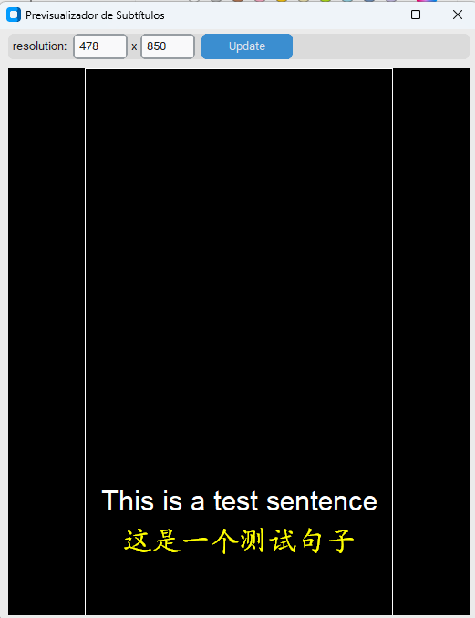

# SubBridge - Generador de Subtítulos

Una aplicación de escritorio para generar y personalizar subtítulos multilingües para tus videos.





## Características

- Interfaz gráfica amigable
- Múltiples idiomas de interfaz (Inglés, Español, 中文)
- Generación automática de subtítulos mediante IA
- Traducción de subtítulos a múltiples idiomas
- Personalización de subtítulos:
  - Color
  - Tamaño de fuente
  - Posición vertical
- Vista previa en tiempo real
- Guardar y cargar configuraciones de flujo de trabajo

## Tecnologías Utilizadas

- **Python 3.10+**: Lenguaje de programación base
- **Paquetes principales**:
  - `moviepy (1.0.3)`: Procesamiento de video
  - `openai-whisper (20231117)`: Reconocimiento de voz mediante IA
  - `googletrans (3.1.0a0)`: Traducción de texto
  - `customtkinter (5.2.1)`: Interfaz gráfica moderna
  - `pillow (10.1.0)`: Procesamiento de imágenes
  - `packaging (>=23.0)`: Gestión de dependencias

## Prerrequisitos

1. Python 3.10 o superior
2. ImageMagick (requerido para el procesamiento de video)
   - Windows: [Descargar ImageMagick](https://imagemagick.org/script/download.php#windows)
   - Durante la instalación, asegúrate de marcar "Install legacy utilities (e.g. convert)"

## Instalación

### Instalación Fácil (Windows)

1. Descarga e instala [Python 3.10 o superior](https://www.python.org/downloads/)
2. Descarga e instala [ImageMagick](https://imagemagick.org/script/download.php#windows)
   - Durante la instalación, asegúrate de marcar "Install legacy utilities (e.g. convert)"
3. Haz doble clic en `install.bat`
4. Espera a que la instalación se complete

### Instalación Manual

1. Clona o descarga este repositorio

2. Crea un entorno virtual (recomendado):
```bash
python -m venv venv
venv\Scripts\activate
```

3. Instala las dependencias:
```bash
pip install -r requirements.txt
```

## Uso

### Inicio Rápido (Windows)

1. Haz doble clic en `run.bat`
2. La aplicación se iniciará automáticamente

### Inicio Manual

1. Activa el entorno virtual si lo creaste:
```bash
venv\Scripts\activate
```

2. Ejecuta la aplicación:
```bash
python subtitle_generator.py
```

3. Pasos básicos:
   - Haz clic en "Cargar video" para seleccionar tu archivo de video
   - Agrega uno o más idiomas de subtítulos usando "Agregar subtítulo"
   - Personaliza el color, tamaño y posición de cada subtítulo
   - Usa "Abrir vista previa" para ver cómo se verán los subtítulos
   - Haz clic en "Generar subtítulos" para crear el video con subtítulos

4. Puedes guardar tu configuración actual como un flujo de trabajo para reutilizarla más tarde

## Idiomas Soportados

La aplicación soporta generación y traducción de subtítulos en más de 50 idiomas, incluyendo:
- Español
- English (Inglés)
- 中文 (Chino)
- Français (Francés)
- Deutsch (Alemán)
- 日本語 (Japonés)
- Y muchos más...

## Notas

- La primera vez que uses la aplicación con un nuevo idioma, el modelo de reconocimiento de voz necesario se descargará automáticamente
- El tiempo de procesamiento dependerá de la duración del video y el número de idiomas seleccionados
- Se recomienda usar videos con audio claro para mejores resultados

## Solución de Problemas

1. Si recibes un error sobre ImageMagick:
   - Asegúrate de haber instalado ImageMagick correctamente
   - Verifica que la opción "Install legacy utilities" esté marcada
   - Reinicia tu computadora después de instalar ImageMagick

---
*Read this in [English](README.md) | 用[中文](README_zh.md)阅读*
