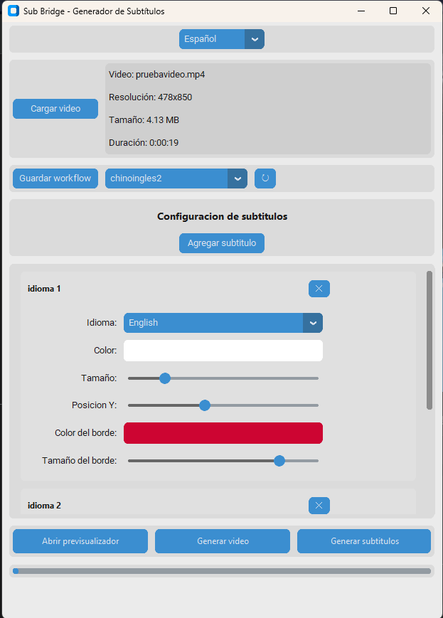

# SubBridge - 字幕生成器

一个用于为视频生成和自定义多语言字幕的桌面应用程序。




## 功能特点

- 用户友好的图形界面
- 多语言界面（英语、西班牙语、中文）
- AI驱动的自动字幕生成
- 字幕翻译成多种语言
- 字幕自定义：
  - 颜色
  - 字体大小
  - 垂直位置
- 实时预览
- 保存和加载工作流配置

## 使用的技术

- **Python 3.10+**: 基础编程语言
- **主要包**:
  - `moviepy (1.0.3)`: 视频处理
  - `openai-whisper (20231117)`: AI语音识别
  - `googletrans (3.1.0a0)`: 文本翻译
  - `customtkinter (5.2.1)`: 现代GUI框架
  - `pillow (10.1.0)`: 图像处理
  - `packaging (>=23.0)`: 依赖管理

## 前提条件

1. Python 3.10 或更高版本
2. ImageMagick（视频处理所需）
   - Windows: [下载 ImageMagick](https://imagemagick.org/script/download.php#windows)
   - 安装时，确保勾选"Install legacy utilities (e.g. convert)"

## 安装

### 简易安装（Windows）

1. 下载并安装 [Python 3.10 或更高版本](https://www.python.org/downloads/)
2. 下载并安装 [ImageMagick](https://imagemagick.org/script/download.php#windows)
   - 安装时，确保勾选"Install legacy utilities (e.g. convert)"
3. 双击 `install.bat`
4. 等待安装完成

### 手动安装

1. 克隆或下载此仓库

2. 创建虚拟环境（推荐）：
```bash
python -m venv venv
venv\Scripts\activate
```

3. 安装依赖：
```bash
pip install -r requirements.txt
```

## 使用方法

### 快速启动（Windows）

1. 双击 `run.bat`
2. 应用程序将自动启动

### 手动启动

1. 如果创建了虚拟环境，请激活它：
```bash
venv\Scripts\activate
```

2. 运行应用程序：
```bash
python subtitle_generator.py
```

3. 基本步骤：
   - 点击"加载视频"选择视频文件
   - 使用"添加字幕"添加一个或多个字幕语言
   - 自定义每个字幕的颜色、大小和位置
   - 使用"打开预览"查看字幕效果
   - 点击"生成字幕"创建带字幕的视频

4. 您可以将当前配置保存为工作流以供以后重用

## 支持的语言

应用程序支持50多种语言的字幕生成和翻译，包括：
- 中文
- English（英语）
- Español（西班牙语）
- Français（法语）
- Deutsch（德语）
- 日本語（日语）
- 以及更多...

## 注意事项

- 首次使用新语言时，需要的语音识别模型将自动下载
- 处理时间将取决于视频时长和选择的语言数量
- 建议使用音频清晰的视频以获得最佳效果

## 故障排除

1. 如果收到关于 ImageMagick 的错误：
   - 确保正确安装了 ImageMagick
   - 验证"Install legacy utilities"选项已勾选
   - 安装 ImageMagick 后重启计算机

---
*Read this in [English](README.md) | Leer esto en [Español](README_es.md)*
